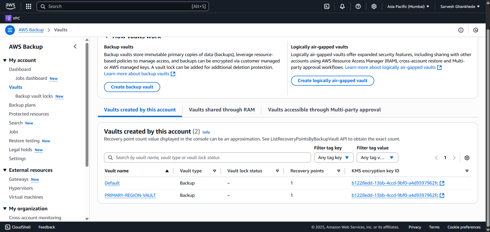
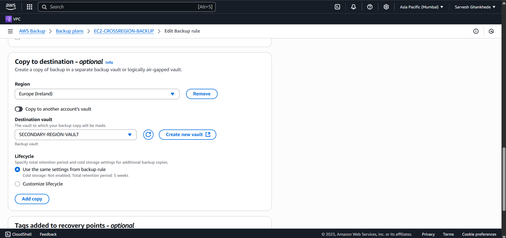
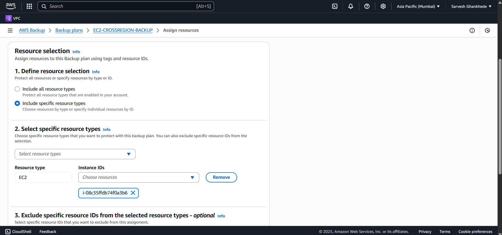
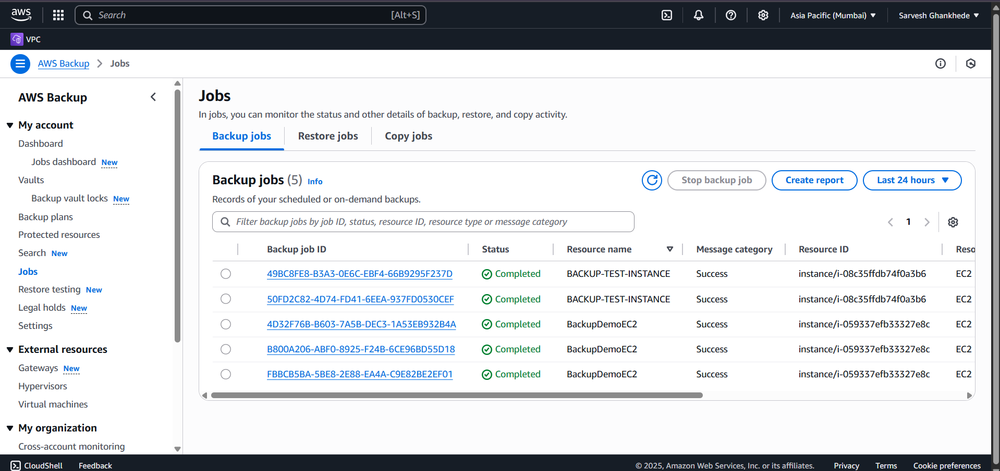
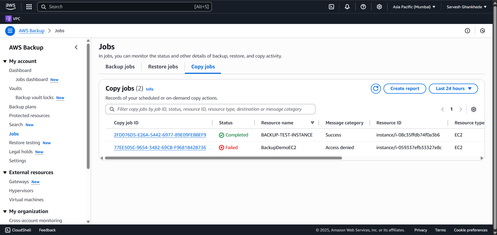
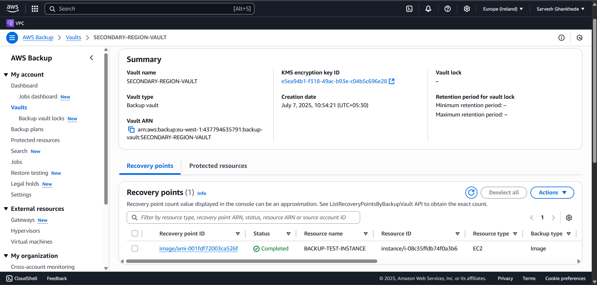

# 📦 AWS EC2 Cross-Region Backup & Recovery Project

---

## 📑 Overview

This project demonstrates how to configure AWS Backup to back up an EC2 instance and replicate backups across regions for disaster recovery and high availability.

---

## 📖 Steps to Configure Cross-Region Backup

### 1️⃣ Launch an EC2 Instance

- Launch a new EC2 instance in your **primary region**
- Instance Type: `t2.micro`
- OS: Amazon Linux / Ubuntu
- Key Pair: New or existing
- Security Group: Allow **SSH (22)** and **HTTP (80)**

**Optional: Install a test web app**
```
sudo yum update -y
sudo yum install httpd -y
sudo systemctl start httpd
sudo systemctl enable httpd
echo "Backup test file - $(date)" > /var/www/html/testfile.txt
```

Test via:
`http://<ec2-public-ip>/testfile.txt`

---

### 2️⃣ Create Source and Destination Backup Vaults

- Go to **AWS Backup → Backup Vaults**
- Create:
  - `PrimaryVault` in your source region (e.g., ap-south-1)
  - `SecondaryVault` in your destination region (e.g., eu-west-1)

📸 **Screenshot: Source and Destination Backup Vaults**


---

### 3️⃣ Create a Backup Plan and Rule with Cross-Region Copy

- Go to **AWS Backup → Backup Plans**
- Create new plan:
  - Name: `EC2BackupPlan`
  - Add a Backup Rule:
    - Name: `EC2DailyBackup`
    - Backup Vault: `PrimaryVault`
    - Backup Frequency: Daily
    - Enable Backup Copy:
      - Destination Region: `eu-west-1`
      - Destination Vault: `SecondaryVault`
      - Copy Frequency: Every backup
      - Retention: 30 days

📸 **Screenshot: Backup Plan Configuration**


---

### 4️⃣ Assign EC2 Resource to Backup Plan

- In **Backup Plans → Assign Resources**
  - Name: `EC2BackupAssignment`
  - Resource Type: EC2
  - Select your EC2 instance

📸 **Screenshot: Resource Assignment**


---

### 5️⃣ Trigger On-Demand Backup and Validate Jobs

- Go to **Protected Resources**
- Select your EC2 instance
- Click **Actions → Backup Now**
- Go to **Backup Jobs** and verify job status: `Completed`
- Go to **Copy Jobs** and confirm copy job status: `Completed`

📸 **Screenshot: Backup Jobs**


📸 **Screenshot: Copy Jobs**


---

### 6️⃣ Verify Recovery Point in Destination Region

- Switch to **destination region (eu-west-1)**
- Go to **AWS Backup → Backup Vaults**
- Open `SecondaryVault`
- Confirm the recovery point is available

📸 **Screenshot: Recovery Point in Destination Region**


---

## 📊 Reason & Benefits of Cross-Region Backup Replication

- 🛡️ **Disaster Recovery**
- 📜 **Regulatory Compliance**
- 🔐 **Data Security**
- 🌐 **Availability**
- 💸 **Cost-Effective DR**

---

## 🛠️ Issues Encountered & How They Were Resolved

| Issue | Resolution |
|:--|:--|
| No **Backup Now** button in Backup Plan interface | Triggered manual backup via **Protected Resources → Backup Now** |
| Copy Jobs initially missing | Verified copy rule setup, ensured vault existed, retried backup |
| Delay in job status updates | Monitored via AWS Backup CLI and allowed time for job processing |

---

## ✅ Deliverables (Attached Screenshots)

- 📸 Source and Destination Backup Vaults
- 📸 Backup Plan Configuration
- 📸 Backup Jobs and Copy Jobs
- 📸 EC2 Recovery Point in Destination Region

---
